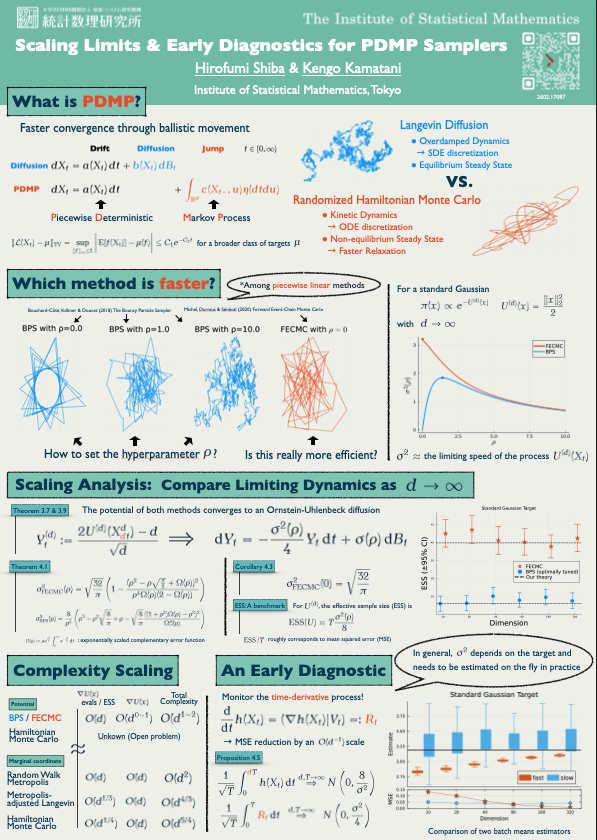

## [ISBA Satellite Meeting 2026](https://kkamatani.github.io/2026-isba-satellite/)

| Date | Location |
|:---:|:------:|
| Jul. 4--7, 2026 | ISM, Tokyo, Japan |

: {.active .hover .bordered .responsive-sm tbl-colwidths="[10,30]"}

[{width="50%"}](ISBA_Satellite/ISBA_Satellite.pdf)
