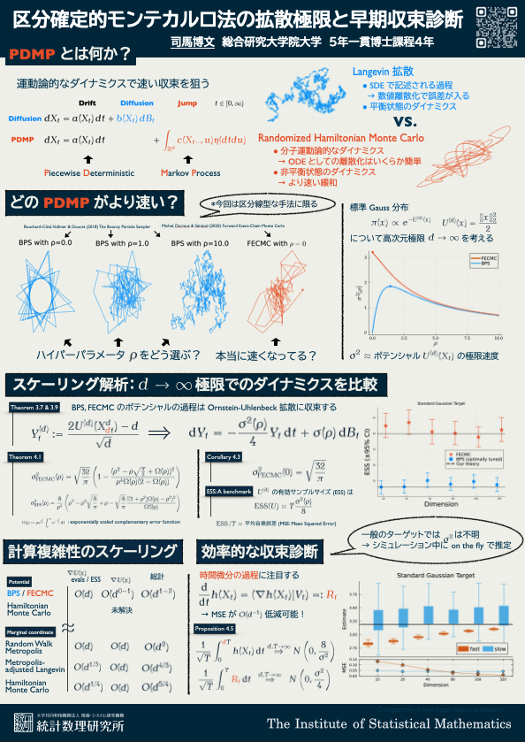

## [統計数理研究所 オープンハウス](https://www.ism.ac.jp/openhouse/2026/index.html)

| Date | Location |
|:------:|:---:|
| May 22rd, 13:00-15:00 | [ISM](https://www.ism.ac.jp/access/index_j.html) 1F |

: ポスター発表時刻 {.active .hover .bordered .responsive-sm tbl-colwidths="[10,20]"}

本ポスターは [@Shiba-Kamatani2026] の内容に基づきます．

## オープンハウス発表ポスター一覧

::: {#lst-OH}
:::