## 研究計画

:::: {.columns}

::: {.column style="text-align: center; width: 50%;"}
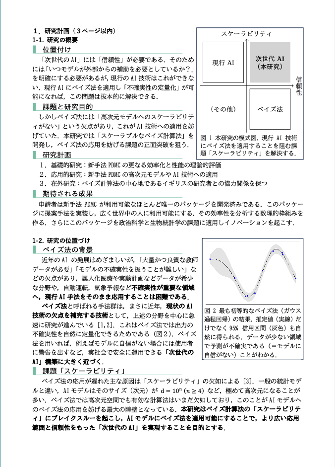
:::

::: {.column style="text-align: center; width: 50%;"}
![主な研究対象である [PDMP アルゴリズム]{.color-unite} の実行途中の図． 発表者開発の `PDMPFlux.jl` パッケージからの出力．](ISM/FECMC.gif)
:::

::::

### 目標：[信頼のおける AI]{.color-unite} の開発

**提案：[ベイズ法]{.color-blue}を使う**

:::: {.columns layout-valign="bottom"}

::: {.column style="text-align: center; width: 50%;"}
[[ベイズ法]{.color-blue}：統計学では歴史が長い]{.small-letter}

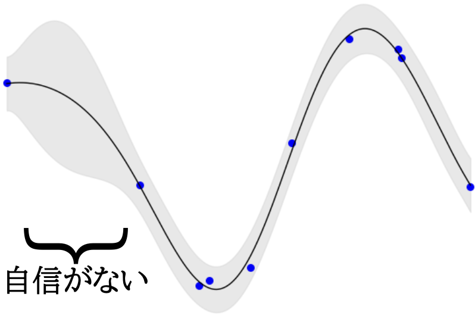
:::

::: {.column style="text-align: center; width: 50%;"}
[[ベイズ]{.color-blue} × [AI]{.color-unite} が近年の問題意識]{.small-letter}

![ベイズ法の自動運転への応用 [@Kendall-Gal2017]](../../2025/Slides/Files/Gal.png)
:::

::::

[→ 行政，政治科学，生物学，個別化医療……への応用]{.small-letter}

### [ベイズ法]{.color-blue}による不確実性の定量化

すでに大きな研究トピックの１つであり，本研究もこれに属する

[![[赤丸]{.color-unite} の中心は `Bayesian Uncertainty Quantification in Deep Learning'](BOOST/Neurips2025_annotated.png)](https://jalammar.github.io/assets/neurips_2025.html){.r-stretch}

### コア要素の１つ：[シミュレーション]{.color-unite}

[ベイズ法]{.color-blue}では確率分布の[シミュレーション]{.color-unite}が計算の中心

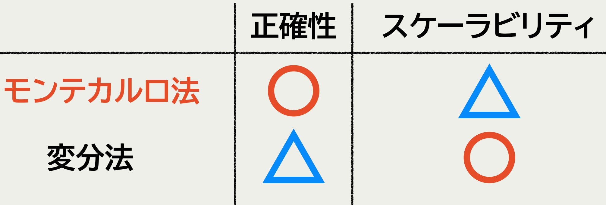

### [PDMP]{.color-unite} による [ベイズ法]{.color-blue} の拡張

**課題**：[ベイズ法]{.color-blue}はスケーラビリティがない

:::: {.columns}
::: {.column style="text-align: center; width: 33%;"}
![[拡散過程（従来法）]{.color-blue}](../../2024/Slides/PDMPs/Langevin.gif)
:::
::: {.column style="text-align: center; width: 33%;"}

::: {.callout-important icon="false" title="新手法 [PDMP]{.color-unite} "}
* 収束 [速]{.color-unite}
* 計算量 [少]{.color-unite}
* 拡張性 [高]{.color-unite}
:::
:::

::: {.column style="text-align: center; width: 33%;"}
![[PDMP（新手法）]{.color-unite}](../../2024/Slides/PDMPs/ZigZag_SlantedGauss2D_longer.gif)
:::
::::

### [PDMP]{.color-unite} パッケージの開発

* 従来は汎用パッケージがなく，[PDMP]{.color-unite} の応用研究は僅少
  → 分野内唯一の汎用 [PDMP]{.color-unite} パッケージを開発
* 公式リポジトリに登録済み 
  → 政治科学・予防医療での共同研究が進行中

[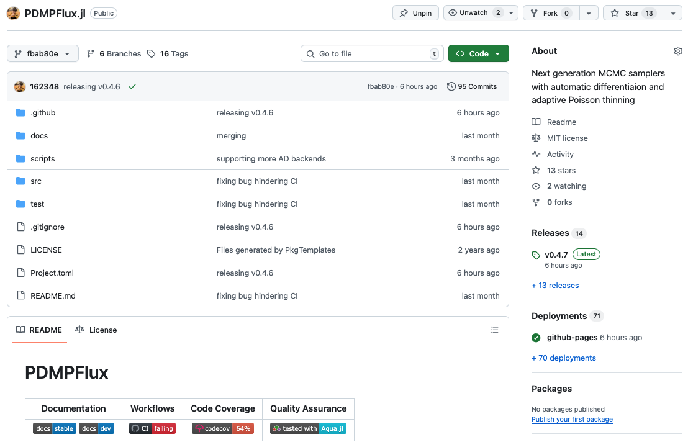](https://github.com/162348/PDMPFlux.jl){.r-stretch}

## 令和7年度の研究（理論）

[@Shiba-Kamatani2026] のプレプリント公開と Annals of Applied Probability への投稿

### 先行研究 {auto-animate=true}

[@Bierkens-Kamatani-Roberts2022], [@Bierkens-Kamatani-Roberts2024]

:::: {.columns}
::: {.column width="33%"}
![動きが単純すぎる [[@Bierkens+2019]]{.small-letter}](../../2024/Slides/PDMPs/ZigZag_SlantedGauss2D.gif)
:::

::: {.column width="33%"}

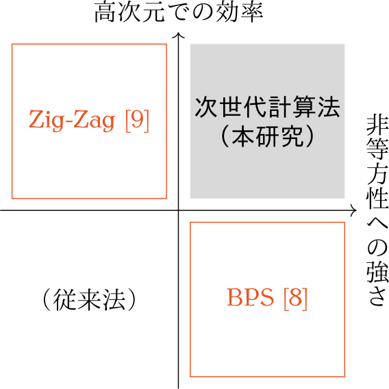
:::

::: {.column width="33%"}
![力学が単純すぎる [[@Bouchard-Cote+2018]]{.tiny-letter}](../../2024/Slides/PDMPs/BPS_SlantedGauss2D.gif)
:::
::::

### 最も有望な手法は理論の射程外 {auto-animate=true}

:::: {.columns}
::: {.column width="33%"}
![Zig-Zag [[@Bierkens+2019]]{.small-letter} 動きが単純すぎる](../../2024/Slides/PDMPs/ZigZag_SlantedGauss2D.gif)
:::

::: {.column width="33%"}
![[新手法 Forward 法]{.color-unite} [[@Michel+2020]]{.small-letter} いずれも適度にランダム](../../2024/Slides/PDMPs/ForwardECMC_StandardGauss2D.gif)
:::

::: {.column width="33%"}
![BPS [[@Bouchard-Cote+2018]]{.tiny-letter} 反射法則が単純すぎる](../../2024/Slides/PDMPs/BPS_SlantedGauss2D.gif)
:::
::::

### 研究開始前の目標

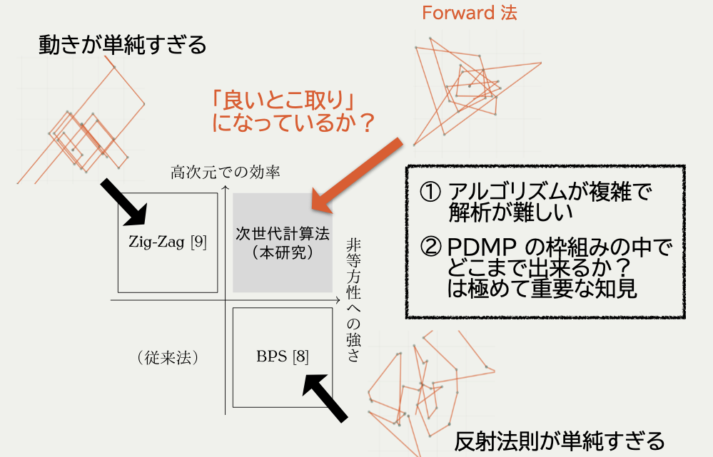{.r-stretch fig-align="center"}

### 研究結果（要約）

1. [FECMC]{.color-unite} 解析の技術的困難を乗り越えて，理論を拡張
2. [FECMC]{.color-unite} が高次元で**常に効率的**であることを示した

### 主貢献1：スケーリング極限の導出

[FECMC]{.color-unite} のスケーリング極限は [BPS]{.color-blue} と同じ形

:::: {.columns style="text-align: center;"}

::: {.column width="50%"}

[$dY_t^{\textcolor{#0096FF}{\text{B}}}=-\frac{\sigma^2_{\textcolor{#0096FF}{\text{B}}}(\rho)}{4}Y_t^{\textcolor{#0096FF}{\text{B}}}\,dt+\sigma_{\textcolor{#0096FF}{\text{B}}}(\rho)\,dB_t$]{.tiny-letter}

[$\sigma^2_{\textcolor{#0096FF}{\text{B}}}(\rho)=8\int^\infty_0e^{-\rho s}\operatorname{E}[R_0^{\textcolor{#0096FF}{\text{B}}}R_s^{\textcolor{#0096FF}{\text{B}}}]\,ds$]{.tiny-letter}
:::

::: {.column width="50%"}

[$dY_t^{\textcolor{#E95420}{\text{F}}}=-\frac{\sigma^2_{\textcolor{#E95420}{\text{F}}}(\rho)}{4}Y_t^{\textcolor{#E95420}{\text{F}}}\,dt+\sigma_{\textcolor{#E95420}{\text{F}}}(\rho)\,dB_t$]{.tiny-letter}

[$\sigma^2_{\textcolor{#E95420}{\text{F}}}(\rho)=8\int^\infty_0e^{-\rho s}\operatorname{E}[R_0^{\textcolor{#E95420}{\text{F}}}R_s^{\textcolor{#E95420}{\text{F}}}]\,ds$]{.tiny-letter}
:::

::::



### 主貢献2：拡散係数の解析的表示 {.smaller}

::: {.callout-tip icon="false" appearance="simple"}

$$
\begin{align*}
\sigma^2_{\textcolor{#E95420}{\text{FECMC}}}(\rho)&=\sqrt{\frac{32}{\pi}}\Paren{1-\frac{\paren{\rho^2-\rho\sqrt{\frac{\pi}{2}}+\Omega(\rho)}^2}{\rho^4\Omega(\rho)(2-\Omega(\rho))}}\\
\sigma^2_{\textcolor{#0096FF}{\text{BPS}}}(\rho)&=\frac{8}{\rho^4}\paren{\rho^3-\rho^2\sqrt{\frac{8}{\pi}}+\rho-\sqrt{\frac{8}{\pi}}\frac{\paren{(1+\rho^2)\Omega(\rho)-\rho^2}^2}{\Omega(2\rho)}}\\
\Omega(\rho)&\coloneqq\sqrt{\frac{\pi}{2}}\rho\operatorname{erfcx}\paren{\frac{\rho}{\sqrt{2}}}=\rho e^{\frac{\rho^2}{2}}\int^\infty_\rho e^{-\frac{t^2}{2}}\,\mathrm{d}t
\end{align*}
$$

:::

$$
\begin{align*}
\underbrace{\frac{\sigma^2(0)}{4}=2\int^\infty_0\E[R_0R_t]\,dt}_{\text{Green--Kubo 公式}}=\E\SQuare{R_0\underbrace{\int^\infty_0\E[R_t|R_0]\,dt}_{=:f(R_0)}}=\E[R_0f(R_0)]
\end{align*}
$$
この関数 $f$ は，動径運動量 $R$ の生成作用素 $L$ に関して次を満たす：
$$
-Lf(x)=x\quad\text{（Poisson 方程式）}
$$

### 拡散係数の比較 [FECMC]{.color-unite} v. [BPS]{.color-blue}

{fig-align="center"}

### 実験との整合：[FECMC]{.color-unite} v. [BPS]{.color-blue} {#sec-experiment}

{fig-align="center"}

## 今後の研究計画（応用）

理論と応用の一気通貫で，

[新手法 PDMP]{.color-unite} の [スケーラビリティ]{.color-unite} を検証する

### 応用研究の着手点

スケーラビリティの大規模統計データでの検証

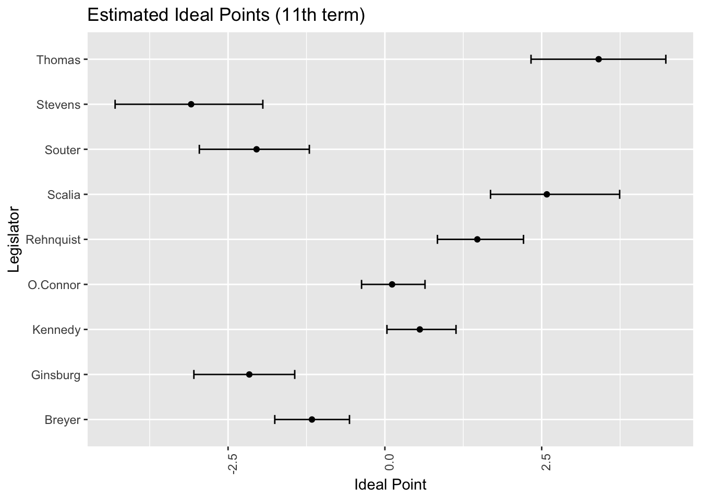

→ [PDMP]{.color-unite} を米国議会議員４３５人に適用できるか……？

### Manifold PDMP の開発

::: {layout="[50,-2,50]" layout-valign="top"}

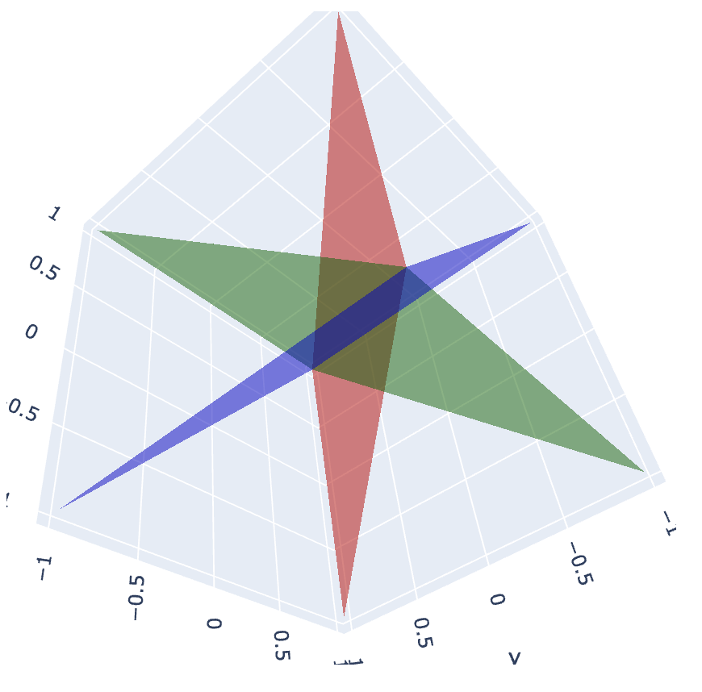

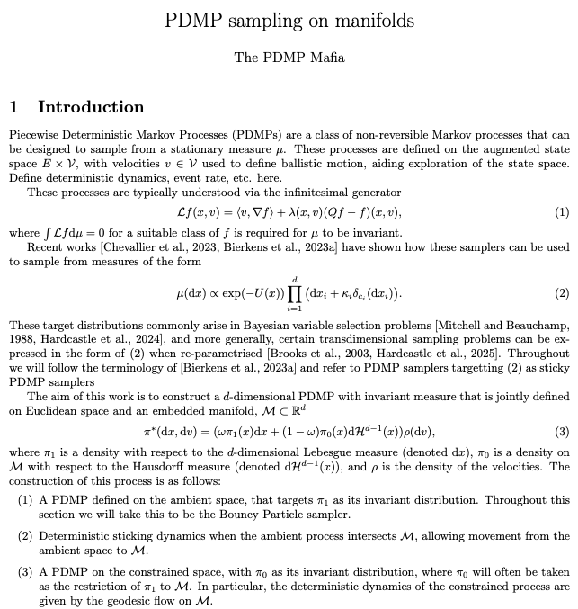

:::

### [PDMP]{.color-unite} の収束診断法の開発

::: {layout="[50,-2,50]" layout-valign="top"}

{fig-align="center"}
{fig-align="center"}

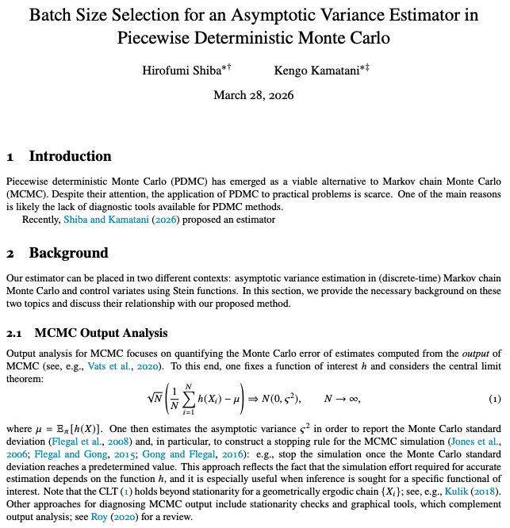

:::

### 共同研究の継続

::: {layout="[50,-2,50]" layout-valign="top"}

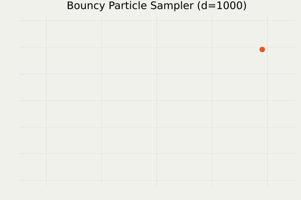
:::

### 参考文献 {.unlisted .unnumbered visibility="uncounted"}