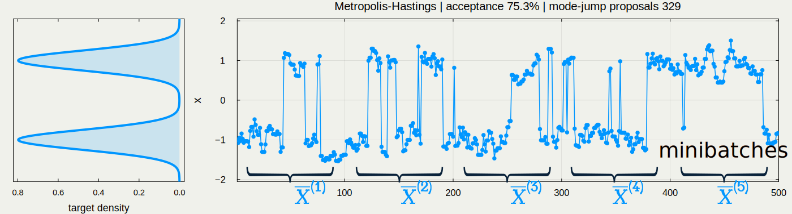
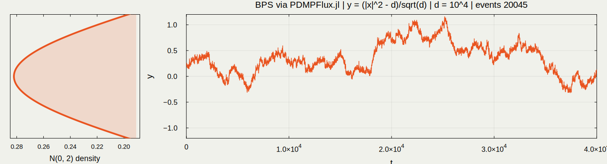
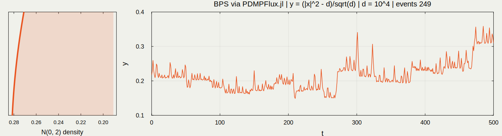
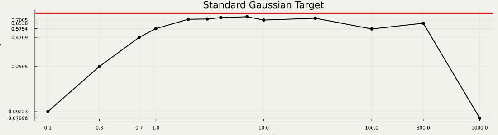

## Today's Contents {.unnumbered .unlisted}

* @sec-1 What is **PDMP**?
  
  → A new class of [continuous-time]{.underline} Monte Carlo methods
* @sec-2 High-Dimensional Scaling Analysis
  
  → [FECMC]{.color-unite} *always* performs better than [BPS]{.color-blue}
* @sec-3 Asymptotic Variance / ESS Estimation
  
  → **PDMP** algorithms allow a more efficient estimator

## What is PDMP? {#sec-1}

:::: {.columns style="text-align: center;"}
::: {.column width="33%"}
![[Markov Chain (1953--)]{.large-letter}](ISM/RWMH2.gif)
:::

::: {.column width="33%"}
![[Langevin Diffusion]{.medium-letter .color-blue} [(1978--)]{.large-letter .color-blue}](ISM/LMC.gif)
:::

::: {.column width="33%"}
![[PDMP (2008--)]{.large-letter .color-unite}](ISM/FECMC.gif)
:::
::::

::: {.content-visible when-format="html" unless-format="revealjs"}
The Monte Carlo method has a long history, approximately 75 years.
Here is my take on the evolution of Monte Carlo methods. The history starts with a Markov chain driven by a simple uniform random variable, originally simulated on the MANIAC computer [@Metropolis+1953]. Then the attention naturally shifted to more structured stochastic processes, such as Langevin diffusion [@Rossky+1978] and PDMP [@Michel+2014], [@Peters-deWith2012].
:::

<!-- ![A [PDMP]{.color-unite}: Forward Event-Chain Monte Carlo](ISM/FECMC_横長.gif)

::: {.content-visible when-format="html" unless-format="revealjs"}
This process is exactly what we are going to be talking about. But first, we place this method in the context of the evolution of Monte Carlo methods, before moving on to a theoretical analysis of PDMP.
:::
-->



### PDMP: Mathematical Definition

{fig-align="center"}

<!-- **Takeaway**: [PDMP]{.color-unite} ≒ [Diffusion]{.color-blue} - Brownian Motion + Jump -->

:::: {.columns style="text-align: center;"}

::: {.column width="45%"}
![[Langevin Diffusion]{.color-blue}](ISM/LMC_横長.gif)
:::

::: {.column width="45%"}
![[Randomized Hamiltonian Monte Carlo]{.color-unite}](ISM/RHMC_横長.gif)
:::

::::

::: {.content-visible when-format="html" unless-format="revealjs"}
One view of PDMP would be a `diffusion' process driven by jumps, rather than a Brownian motion. An immediate consequence is a strong ballistic / transport property, which is typically absent in a Langevin diffusion. Informally, the Brownian term moves in a scale $\Delta B_t \sim \sqrt{\Delta t}$, while the jump term moves in a scale $\Delta J_t \sim \Delta t$.
:::

### Classical MCMC Methods Turn Out to Be [PDMPs]{.color-unite} in Disguise

Many [PDMPs]{.color-unite} behave similarly in high dimensions.

:::: {.columns style="text-align: center;"}

::: {.column width="50%"}

discretized by symplectic integrator

e.g. HMC has $O(d^{1.25})$ complexity
:::

::: {.column width="50%"}
![[BPS]{.color-unite} with Gaussian speed $(d=10^3)$](ISM/BPS_GaussianSpeed2.gif)

simulate piecewise linear trajectory

e.g. BPS with normal velocity has $O(d^{1.5})$ complexity
:::

::::

::: {.content-visible when-format="html" unless-format="revealjs"}
So far, I may have suggested that PDMP is an entirely new class of MCMC methods.
Yes, in some sense, e.g., the output is a continuous trajectory instead of a set of discrete samples.
However, though the term may be new to the field, it might be nothing new conceptually. To me, PDMP also works as an umbrella term that helps shed light upon a previously overlooked aspect of classical MCMC methods.

This is a somewhat strong claim, but let me pose it this way. Somehow, every successful MCMC method is implicitly a PDMP. To be precise, it chases Hamiltonian dynamics in high-dimensional settings, which may be one of the reasons why PDMP is a class of Markov processes worth considering collectively [@Deligiannidis+2021].

The randomized Hamiltonian Monte Carlo dynamics mix fast regardless of the dimension (for a certain class of target). From this point of view, classical Hamiltonian Monte Carlo and Bouncy Particle Sampler give different ways of numerically simulating the same dynamics.

We see a trade-off between the computational complexity and the robustness of the method.
:::

### Digression: Killer Applications of PDMP

:::: {.columns valign="center"}

::: {.column width="70%"}
![$x$: CPU time, $y$: Estimate．[@Bouchard-Cote+2018] Sparse Markov Random Field with $d=10$](ISM/Bouchard-Cote+2018.png)
:::

::: {.column width="30%" .vcenter}

$O(d^1)$ [**Local Implementation**]{.normal-letter .underline}

Exploiting sparsity, [BPS]{style="color: #E67C71;"} atteins better scaling than [HMC]{style="color: #56BCC2;"} (MSE/sec.)

:::

::::

:::: {.columns}

::: {.column width="40%"}
![[@Bierkens+2019]](ISM/Bierkens+2019.png)
:::

::: {.column width="60%"}
[**Stochastic Gradient**]{.normal-letter .underline} $O(n^0)$

$x$: sample size $n$, $y$: log ESS 
Logistic regression with $d=16$ 
Using an appropriate control variate, the efficiency of [Zig-Zag]{style="color: magenta;"} is $O(1)$ 
in the limit of $n\to\infty$, it outperforms [Langevin]{style="color: #75FB4D;"}.
:::

::::

::: {.content-visible when-format="html" unless-format="revealjs"}
I briefly touch upon some killer applications of PDMP, as they are important motivations for the development of PDMP.
:::

## Towards Better Jump Strategy: A Scaling Analysis {#sec-2}

We compare two famous PDMP methods under the following condition:

* ODE: Fixed
* Jump: [Reflection + Refreshment]{.color-blue} vs. [Combination]{.color-unite}
* Target: High dimensional standard Gaussian

{fig-align="center"}

### [FECMC]{.color-unite} vs. [BPS]{.color-blue} {#sec-FECMC-vs-BPS}

:::: {.columns}

::: {.column width="33%"}
![[Forward Event Chain Monte Carlo]{.color-unite} [@Michel+2020]](ISM/FECMC_0.0_Trajectory.gif)
:::

::: {.column width="33%"}
![[Bouncy Particle Sampler]{.color-blue} [@Bouchard-Cote+2018]](ISM/BPS_1.0_Trajectory.gif)
:::

::: {.column width="33%"}
![[BPS]{.color-blue} with different hyperparameter $\rho$](ISM/BPS_10.0_Trajectory.gif)
:::

::::

::: {.content-visible when-format="html" unless-format="revealjs"}
To get straight to the point, we compare the two methods with possibly different hyperparameter values $\rho$.
Once animated, one might easily see the red method, Forward Event-Chain Monte Carlo proposed in [@Michel+2020], is the fastest.
We would like to show this quantitatively, together with dependence upon $\rho$.
:::

### Jump Strategy in [FECMC]{.color-unite} vs. [BPS]{.color-blue}

:::: {.columns}

::: {.column width="33%"}
![[Stochastic Reflection]{.color-unite .medium-letter}](IMS-APRM/FECMC.png)
:::

::: {.column width="33%"}
![[Reflection]{.color-blue .medium-letter}](IMS-APRM/BPS_reflection.png)
:::

::: {.column width="33%"}
![[Refreshment $\rho$]{.color-blue .medium-letter}](IMS-APRM/BPS_refreshment.png)
:::

::::

::: {.content-visible when-format="html" unless-format="revealjs"}
The velocity jump mechanism in [BPS]{.color-blue} is simpler and we start with it.
When jumps, the BPS process either reflect or refresh. On reflection, the process changes the velocity as a light ray does, matching the incidence and reflection angles. On refreshment, the process resamples the velocity from the invariant distribution, a uniform distribution on the unit sphere in our setting.

Forward Event-Chain Monte Carlo, on the other hand, is more sophisticated, combining the two mechanisms.
:::

### Empirical Comparison: [BPS]{.color-blue} vs. [FECMC]{.color-unite} {#sec-comparison}

### Scaling Analysis = Deriving a Diffusion Limit

$$
\text{Plotting } \textcolor{#0096FF}{Y_t^{(d)}}=\frac{\abs{\textcolor{#0096FF}{X}_{d\textcolor{#0096FF}{t}}^{\textcolor{#0096FF}{(d)}}}^2-d}{\sqrt{d}} \text{ with } d=10^2,10^3,10^4:
$$

{fig-align="center"}

### Theorem 1： Diffusion Limits of [FECMC]{.color-unite} & [BPS]{.color-blue}

:::: {.columns style="text-align: center;"}

::: {.column width="50%"}

$$
dY_t^{\textcolor{#0096FF}{\text{B}}}=-\frac{\sigma^2_{\textcolor{#0096FF}{\text{B}}}(\rho)}{4}Y_t^{\textcolor{#0096FF}{\text{B}}}\,dt+\sigma_{\textcolor{#0096FF}{\text{B}}}(\rho)\,dB_t
$$
$$
\sigma^2_{\textcolor{#0096FF}{\text{B}}}(\rho)=8\int^\infty_0e^{-\rho s}\E[R_0^{\textcolor{#0096FF}{\text{B}}}R_s^{\textcolor{#0096FF}{\text{B}}}]\,ds
$$
:::

::: {.column width="50%"}

$$
dY_t^{\textcolor{#E95420}{\text{F}}}=-\frac{\sigma^2_{\textcolor{#E95420}{\text{F}}}(\rho)}{4}Y_t^{\textcolor{#E95420}{\text{F}}}\,dt+\sigma_{\textcolor{#E95420}{\text{F}}}(\rho)\,dB_t
$$
$$
\sigma^2_{\textcolor{#E95420}{\text{F}}}(\rho)=8\int^\infty_0e^{-\rho s}\E[R_0^{\textcolor{#E95420}{\text{F}}}R_s^{\textcolor{#E95420}{\text{F}}}]\,ds
$$

:::

::::

### Theorem 2: Analytic Expression of $\sigma^2$'s

![While [BPS]{.color-blue} atteins maximum at non-trivial value of $\rho$, [FECMC]{.color-unite} achieves maximum at $\rho=0$](ISM/sigma.svg){fig-align="center"}

## Asymptotic Variance / ESS Estimation for [PDMP]{.color-unite} [(or continuous-time MCMC more broadly)]{.tiny-letter} {#sec-3}

There is a fundamental difference between the Monte Carlo estimators produced by

$$
\text{PDMP}\quad\wh{h}_T^{\textcolor{#E95420}{\text{PDMP}}}=\frac{1}{T}\int^T_0h(\textcolor{#E95420}{X}_{\textcolor{#E95420}{t}}^{\textcolor{#E95420}{(d)}})\,dt,\quad t\in[0,T],
$$
$$
\text{classical MCMC}\quad\wh{h}_N^{\textcolor{#0096FF}{\text{MCMC}}}=\frac{1}{N}\sum_{n=1}^Nh(\textcolor{#0096FF}{X_n^{(d)}}),\quad n=1,\cdots,N.
$$

Exploiting this continuous-time nature of PDMP, we can introduce more efficient estimators for the asymptotic variance of $\wh{h}_T^{\textcolor{#E95420}{\text{PDMP}}}$.

::: {.content-visible when-format="html" unless-format="revealjs"}
Algorithmically, there is a fundamental difference in the Monte Carlo estimator produced by PDMP & classical MCMC.
As the algorithm outputs a continuous trajectory, we are able to look into fine structure of the trajectory, which is not possible with classical MCMC.
:::

### Implications of the Diffusion Limit Results

::: {.callout-tip title="Corollary (Relationship between $\sigma^2$ and ESS)" icon="false"}

The effective sample size (ESS) for estimating $U$ with a trajectory of length $\textcolor{#E95420}{d}T$ is given by
$$
\operatorname{ESS}(U)\fallingdotseq\frac{\sigma^2}{8}T\qquad(d\to\infty).
$$

:::

_[Proof]_ The Monte Carlo estimator (= ergodic average of $\textcolor{#E95420}{\{X_t\}}$)
$$
\wh{h}_T^d:=\frac{1}{T}\int^T_0U(\textcolor{#E95420}{X_t^{(d)}})\,dt
$$
has a computable variance under double asymptotic limit:
$$
\lim_{T\to\infty}\lim_{d\to\infty}T\frac{\Var[\wh{h}_{\textcolor{#E95420}{d}T}^d]}{\Var_\pi[U]}=\frac{8}{\sigma^2}\approx2.50\cdots.
$$
ESS equals the inverse of this variance ratio.

### Theory Matches Practice: [FECMC]{.color-unite} vs. [BPS]{.color-blue} {#sec-experiment}

{fig-align="center"}

### Asymptotic Variance Estimation for [MCMC]{.color-blue}

{fig-align="center"}

$$
\text{Markov Chain CLT: }\quad\frac{1}{\sqrt{N}}\sum_{n=1}^NX_n\Rightarrow N(0,\sigma^2_{\text{asym}})\quad(N\to\infty).
$$
For mini-batches $b=1,\cdots,B$ with length $m:=N/B$,
$$
\operatorname*{{Batch\; Means\; Estimator:}}_{\text{(for mean estimation)}} \text{ }\quad\wh{\sigma^2}_\text{asym}:=\frac{m}{B-1}\sum_{b=1}^B\left(\textcolor{#0096FF}{\ov{{X}}^{(b)}}-\textcolor{#0096FF}{\ov{{X}}}\right)^2,
$$
where $\textcolor{#0096FF}{\ov{{X}}^{(b)}}=\frac{1}{m}\sum_{n=1}^m\textcolor{#0096FF}{X_{n+(b-1)m}}$ is the mean over the $b$-th batch.

### Optimal Batch Size for [Classical MCMC]{.color-blue} & [PDMP]{.color-unite}

![Due to the continuous-time nature, batch size selection becomes a nontrivial problem for [PDMPs]{.color-unite}.](IMS-APRM/mixture_bps_pdmpflux_trace_T2000_wide_red.svg){fig-align="center"}

:::: {.columns style="text-align: left;"}

::: {.column width="50%"}
::: {.callout-note icon="false" title="MSE Minimizing Batch Size for Classical MCMC [@Liu+2022]"}

$$
m_{\text{opt}}=\paren{\frac{\gamma_{\text{disc}}}{\sigma_{\text{asym}}^2}}^{\frac{2}{3}}N^{\frac{1}{3}}
$$
minimizes the MSE asymptotically under
$$
m\to\infty,\qquad N/m\to\infty,
$$
for a sufficiently mixing Markov chain $\{\textcolor{#0096FF}{X_n}\}$.

:::
:::

::: {.column width="50%"}
::: {.callout-important icon="false" title="Bias Minimizing Batch Size for PDMP (S. & Kamatani 2026+)"}

Analogously, with
$$
\gamma_{\text{disc}}=2\sum_{k=0}^\infty k\operatorname{Cov}[\textcolor{#0096FF}{X_0},\textcolor{#0096FF}{X_k}]
$$
replaced by
$$
\gamma_{\text{cont}}=2\int^\infty_0t\operatorname{Cov}[\textcolor{#E95420}{X_0},\textcolor{#E95420}{X_t}]\,dt.
$$

:::
:::

::::

### Diffusivity Estimation for High-dimensional [PDMPs]{.color-unite}

= **Quadratic Variation (QV) Estimation** under Misspecification

{fig-align="center"}

The Realized Variation estimator [@Barndorff-Nielsen-Shephard2002]
$$
\wh{Q}^d:=\frac{1}{T}\sum_{n=1}^N\Paren{Y_{\Delta n}^d-Y_{\Delta(n-1)}^d}^2,\quad T=\Delta N,
$$
converges to $\sigma^2$ under the conditions
$$
\Delta\to0,\quad d\to\infty,\quad\Delta d\to\infty.
$$

### Experiment: QV Estimation Improves with Dimension

![[slow]{.color-blue} corresponds to the [Batch Means estimator]{.color-blue}, [fast]{.color-unite} corresponds to the [Realized Variation estimator]{.color-unite}](IMS-APRM/BM_iso.svg){fig-align="center"}

### 3.6 Experiment: QV Estimation Improves with Dimension {.unnumbered}

![[slow]{.color-blue} corresponds to the [Batch Means estimator]{.color-blue}, [fast]{.color-unite} corresponds to the [Realized Variation estimator]{.color-unite}](IMS-APRM/BM_aniso.svg){fig-align="center"}

### Batch Size Selection for the QV Estimator

$\fallingdotseq$ sampling step size $\Delta$ selection **under Misspecification** [@Ait-Sahalia+2011]

{fig-align="center"}

:::: {.columns style="text-align: left;" layout-valign="center"}
::: {.column width="30%"}

For too small / large $\Delta$,
$$
\wh{Q}^{d}(\Delta)\approx0.
$$
The optimal choice seems to be $\Delta=O(d^{1/2})$.

:::

::: {.column width="70%"}
{fig-align="center"}
:::
::::

## Conclusion {.unlisted .unnumbered}

1. Reducing redundant noise produces a more efficient algorithm: [BPS]{.color-blue} → [FECMC]{.color-unite}
2. Continuous-time MCMC allows more efficient estimators for asymptotic variance
    * potentially works whenever a diffusion limit exists

## References {.unlisted .unnumbered visibility="uncounted"}

::: {#refs}
:::

