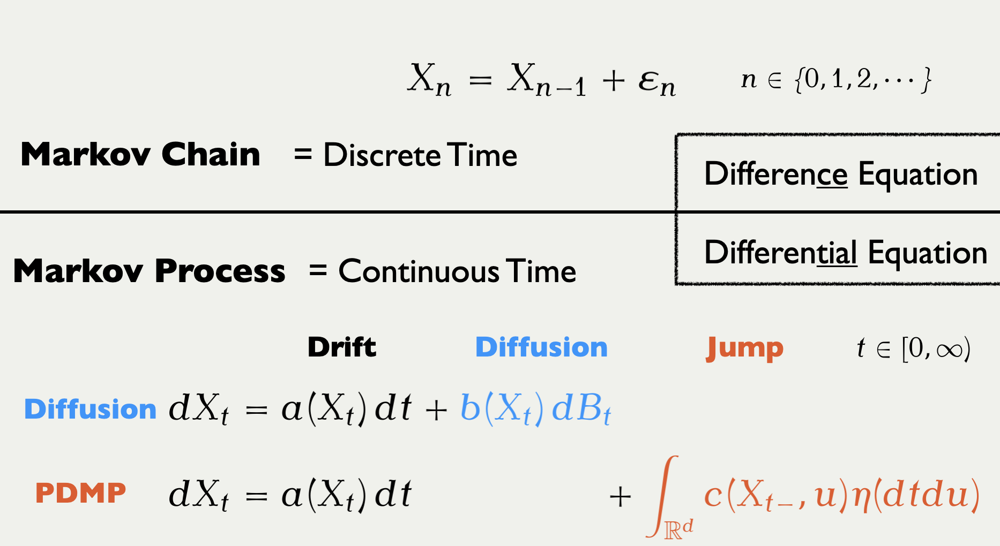

## What is a [PDMP]{.color-unite}?

![An illustration of a [Piecewise Deterministic Markov Process]{.color-unite}. Output from the `PDMPFlux.jl` package.](../../2024/Slides/PDMPs/ZigZag_SlantedGauss2D_横長.gif)



### Three Categories of Monte Carlo

:::: {.columns style="text-align: center;"}
::: {.column width="33%"}
![[Markov Chain (1953--)]{.large-letter}](../../2024/Slides/PDMPs/RWMH.gif)
:::

::: {.column width="33%"}
![[Diffusion (1978--)]{.large-letter .color-blue}](../../2024/Slides/PDMPs/Langevin.gif)
:::

::: {.column width="33%"}
![[PDMP (2008--)]{.large-letter .color-unite}](../../2024/Slides/PDMPs/ZigZag_SlantedGauss2D_longer.gif)
:::
::::

### [PDMP]{.color-unite} ≒ ODE + Jump

### Which One is Faster ?

:::: {.columns}

::: {.column width="50%"}
![[Bouncy Particle Sampler]{.large-letter} [@Bouchard-Cote+2018]](../../2024/Slides/PDMPs/BPS_SlantedGauss2D.gif){width="70%"}
:::

::: {.column width="50%"}
![[Forward Event-Chain Monte Carlo]{.large-letter} [@Michel+2020]](../../2024/Slides/PDMPs/ForwardECMC_StandardGauss2D.gif){width="70%"}
:::

::::