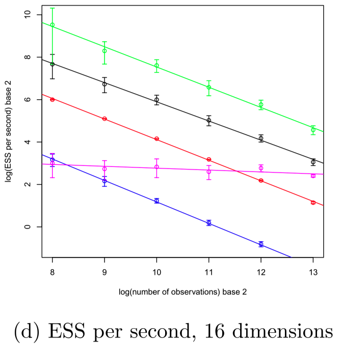
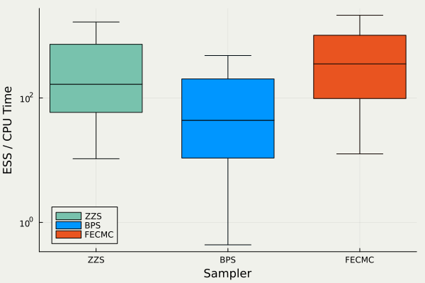

## 背景：[PDMP]{.color-unite} の目指す下剋上

![モンテカルロ法に用いられる [PDMP]{.color-unite} の例：Forward Event-Chain Monte Carlo](ISM/FECMC_横長.gif)



### モンテカルロ法小史

:::: {.columns style="text-align: center;"}
::: {.column width="33%"}
![[酔歩 （1953〜）]{.large-letter}](ISM/RWMH2.gif)
:::

::: {.column width="33%"}
![[拡散過程 （1978〜）]{.large-letter .color-blue}](ISM/LMC.gif)
:::

::: {.column width="33%"}
![[PDMP （2008〜）]{.large-letter .color-unite}](ISM/FECMC.gif)
:::

::::

### [P]{.color-unite}iecewise [D]{.color-unite}eterministic [M]{.color-unite}arkov [P]{.color-unite}rocess

**直感**：[**SDE**]{.color-blue} より [**ODE**]{.color-unite} の離散化の方が簡単

:::: {.columns style="text-align: center;"}

::: {.column width="50%"}
![[Langevin Diffusion]{.color-blue}](ISM/LMC_横長.gif)
:::

::: {.column width="50%"}
![[Randomized Hamiltonian Monte Carlo]{.color-unite}](ISM/RHMC_横長.gif)
:::

::::

### 新しい離散化パラダイムとしての [PDMP]{.color-unite}

PDMP サンプラーは ODE Solver なしで Hamiltonian flow を近似できる

:::: {.columns style="text-align: center;"}

::: {.column width="50%"}
![[RHMC]{.color-unite}](ISM/RHMC.gif)

symplectic integrator で離散化

$O(d^{1.25})$ の計算複雑性
:::

::: {.column width="50%"}
![[BPS]{.color-unite} with Guassian speed](ISM/BPS_GaussianSpeed.gif)

大量の [Poisson 点測度]{.color-minty} で近似

通常時は $O(d^{1.5})$ の計算複雑性
:::

::::

### [PDMP]{.color-unite} は離散化法としての自由度がすごい

:::: {.columns valign="center"}

::: {.column width="70%"}
![横軸：時間，縦軸：推定量．[@Bouchard-Cote+2018] スパースな相互作用を持つマルコフ確率場モデル（$d=10$）](ISM/Bouchard-Cote+2018.png)
:::

::: {.column width="30%" .vcenter}

[BPS]{style="color: #56BCC2;"} で，local implementation をすると，[HMC]{style="color: #E67C71;"} よりも，「推定量の分散／計算時間」が良い．

:::

::::

:::: {.columns}

::: {.column width="40%"}

:::

::: {.column width="60%"}
横軸：観測数 $n$，縦軸：有効サンプル数．

ロジスティック回帰（$d=16$）．

[Zig-Zag]{style="color: magenta;"} で，control variate を用いる [@Bierkens+2019] と，データサイズ $n$ に対して $O(1)$ の性能

$n\to\infty$ の極限で [Langevin]{style="color: #75FB4D;"} を越す．
:::

::::

## [等速直線ダイナミクス]{.color-unite} でどこまで行けるか？

### Scaling Analysis

### 先行研究：Zig-Zag v. BPS

### Zig-Zag v. BPS .v FECMC

## 応用：[PDMP]{.color-unite} の収束判定

## 参考文献 {.unnumbered .unlisted .uncounted}

::: {#refs}
:::

