## 背景：[PDMP]{.color-unite} とその特殊性

![モンテカルロ法に用いられる [PDMP]{.color-unite} の例：Forward Event-Chain Monte Carlo](ISM/FECMC_横長.gif)



### モンテカルロ法小史

:::: {.columns style="text-align: center;"}
::: {.column width="33%"}
![[酔歩 （1953〜）]{.large-letter}](ISM/RWMH2.gif)
:::

::: {.column width="33%"}
![[拡散過程 （1978〜）]{.large-letter .color-blue}](ISM/LMC.gif)
:::

::: {.column width="33%"}
![[PDMP （2008〜）]{.large-letter .color-unite}](ISM/FECMC.gif)
:::

::::

### [P]{.color-unite}iecewise [D]{.color-unite}eterministic [M]{.color-unite}arkov [P]{.color-unite}rocess

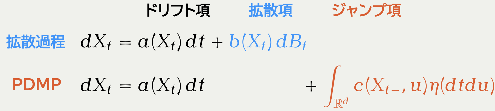

**直感**：[**SDE**]{.color-blue} より [**ODE**]{.color-unite} の離散化の方が「扱いやすい」

:::: {.columns style="text-align: center;"}

::: {.column width="50%"}
![[Langevin Diffusion]{.color-blue}](ISM/LMC_横長.gif)
:::

::: {.column width="50%"}
![[Randomized Hamiltonian Monte Carlo]{.color-unite}](ISM/RHMC_横長.gif)
:::

::::

### HMC v. [PDMP]{.color-unite}：高次元ではほぼ同じ．離散化が違うのみ

[PDMP]{.color-unite} サンプラーは ODE Solver なしで Hamiltonian flow を近似できる

:::: {.columns style="text-align: center;"}

::: {.column width="50%"}
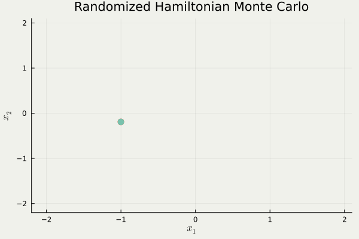

symplectic integrator で離散化

$O(d^{1.25})$ の計算複雑性
:::

::: {.column width="50%"}
![[BPS]{.color-unite} with Gaussian speed $(d=10^3)$](ISM/BPS_GaussianSpeed2.gif)

大量の [Poisson 点測度]{.color-minty} で近似

通常時は $O(d^{1.5})$ の計算複雑性
:::

::::

### [PDMP]{.color-unite} は killer application での爆発力がすごい

:::: {.columns valign="center"}

::: {.column width="70%"}
![横軸：時間，縦軸：推定量．[@Bouchard-Cote+2018] スパースな相互作用を持つマルコフ確率場モデル（$d=10$）](ISM/Bouchard-Cote+2018.png)
:::

::: {.column width="30%" .vcenter}

[**局所実装**]{.normal-letter .underline} $O(d^1)$

[BPS]{style="color: #E67C71;"} で，sparsity を利用した実装をすると，[HMC]{style="color: #56BCC2;"} よりも「推定量の分散／時」が良い．

:::

::::

:::: {.columns}

::: {.column width="40%"}
![[@Bierkens+2019]](ISM/Bierkens+2019.png)
:::

::: {.column width="60%"}
[**Stochastic Gradient**]{.normal-letter .underline} $O(n^0)$

横軸：観測数 $n$，縦軸：有効サンプルサイズ． 
ロジスティック回帰（$d=16$）． 
[Zig-Zag]{style="color: magenta;"} で，control variate を用いると，データサイズ $n$ に対して $O(1)$ の性能 
$n\to\infty$ の極限で [Langevin]{style="color: #75FB4D;"} を越す．
:::

::::

## [等速直線ダイナミクス]{.color-unite} でどこまで行けるか？

HMC は Metropolis--Hastings 界のトップ．PDMP のトップは？

* スケーリング解析の導入＋既存研究 ([-@sec-global-refresh] -- [-@sec-σ-BPS])
* 今回の研究成果 ([-@sec-FECMC-vs-BPS] -- [-@sec-experiment])

### [BPS]{.color-blue} の大域的リフレッシュパラメータ $\rho$ {#sec-global-refresh}

:::: {.columns}

::: {.column width="33%"}
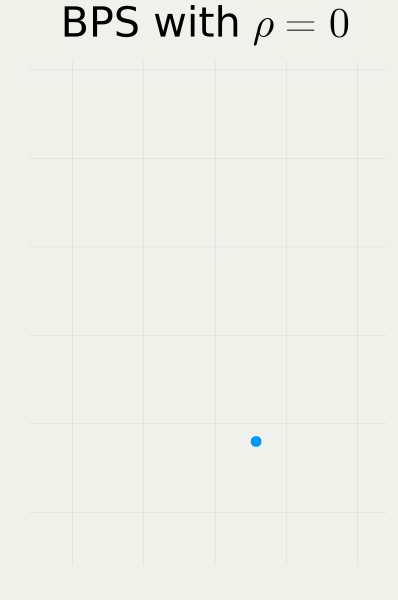
:::

::: {.column width="33%"}
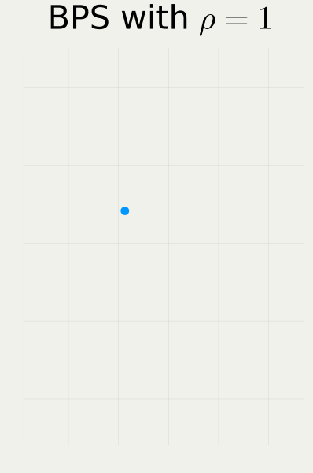
:::

::: {.column width="33%"}
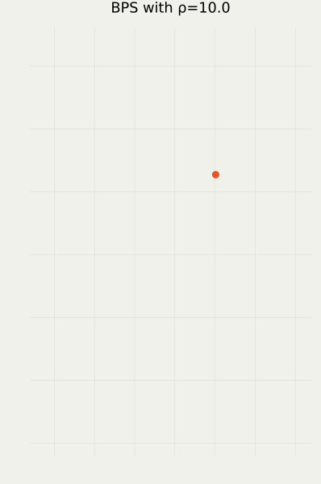
:::

::::

### [BPS]{.color-blue} $\textcolor{#0096FF}{\{X_t\}}$ のスケーリング解析

定常分布 $X_0\sim\pi$ から実行したときの低次元射影
$$
\textcolor{#0096FF}{Y_t^{(d)}}:=\frac{U(\textcolor{#0096FF}{X_{d^\gamma t}})-\E_\pi[U(\textcolor{#0096FF}{X_{d^\gamma t}})]}{\sqrt{\Var_\pi[U(\textcolor{#0096FF}{X_{d^\gamma t}})]}},\quad U:\R^d\to\R\text{: 射影},\;\textcolor{#0096FF}{\gamma}>0
$$
の，$d\to\infty$ の極限での挙動を解析する．

::: {.callout-tip title="定義（最適スケーリング $\gamma$）" icon="false"}

$\textcolor{#0096FF}{Y_t^{(d)}}$ がある $\gamma>0$ について，$d\to\infty$ の極限で**拡散過程**に収束するとき，この $\gamma$ を **最適スケーリング** という．

:::

:::: {.columns style="text-align: center;"}

::: {.column width="50%"}
::: {.callout-important appearance="simple" icon="false" title="射影 $U$ の例"}
* 有限次元周辺過程：$U(x)=x_1$
* 負の対数密度：$U(x)=-\log\pi(x)$
:::
:::

::: {.column width="50%"}
::: {.callout-important appearance="simple" icon="false" title="$\gamma$ の例 （$U(x)=x_1$ のとき）"}
* 酔歩 MH は $\gamma=1$
* Langevin は $\gamma=1/3$
:::
:::

::::

### [BPS]{.color-blue} の拡散スケーリング極限（$\gamma=1$）

$\textcolor{#0096FF}{Y_t^{(d)}}$ を $U(x)=-\log\pi(x)$ について，$d=10^2,10^3,10^4$ でプロットしてみる：

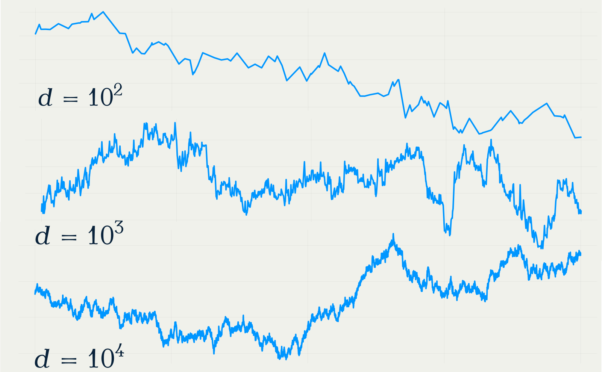{fig-align="center"}

### 先行研究：Zig-Zag v. [BPS]{.color-blue} [[@Bierkens-Kamatani-Roberts2022]]{.small-letter}

:::: {.columns style="text-align: center;"}

::: {.column width="50%"}

$$
L(s,t)=2-\int^t_s\int^t_sK(u,v)\,dudv
$$

$K$ は動径運動量 $R$ のカーネル $K(s,t)=\E[R_sR_t]$
:::

::: {.column width="50%"}
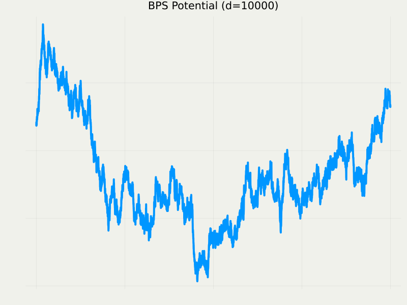

$$
dY_t=-\frac{\sigma^2(\rho)}{4}Y_t\,dt+\sigma(\rho)\,dB_t
$$
$$
\sigma^2(\rho)=8\int^\infty_0e^{-\rho s}K(s,0)\,ds
$$
:::

::::

### 拡散係数 $\sigma$ の近似 → 漸近最適なハイパラ選択基準 {#sec-σ-BPS}

{fig-align="center"}

### [FECMC]{.color-unite} という新星：$\rho$ の排除 {#sec-FECMC-vs-BPS}

:::: {.columns}

::: {.column width="33%"}
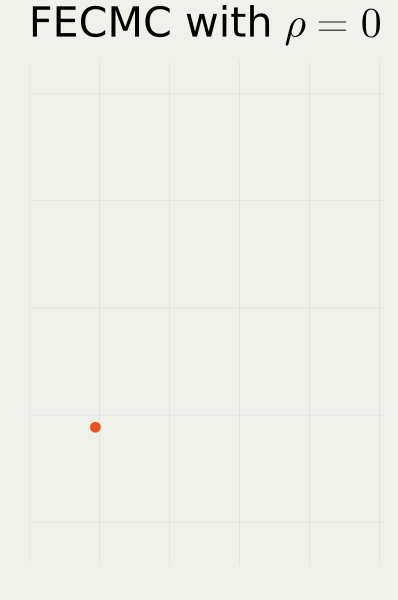
:::

::: {.column width="33%"}

:::

::: {.column width="33%"}

:::

::::

### 効率性比較：Zig-Zag v. [BPS]{.color-blue} v. [FECMC]{.color-unite} {#sec-comparison}

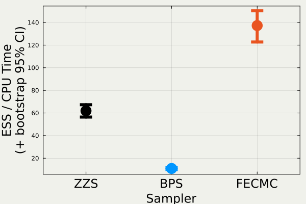

### 主貢献1：[FECMC]{.color-unite} のスケーリング極限は [BPS]{.color-blue} と同じ形

:::: {.columns style="text-align: center;"}

::: {.column width="50%"}
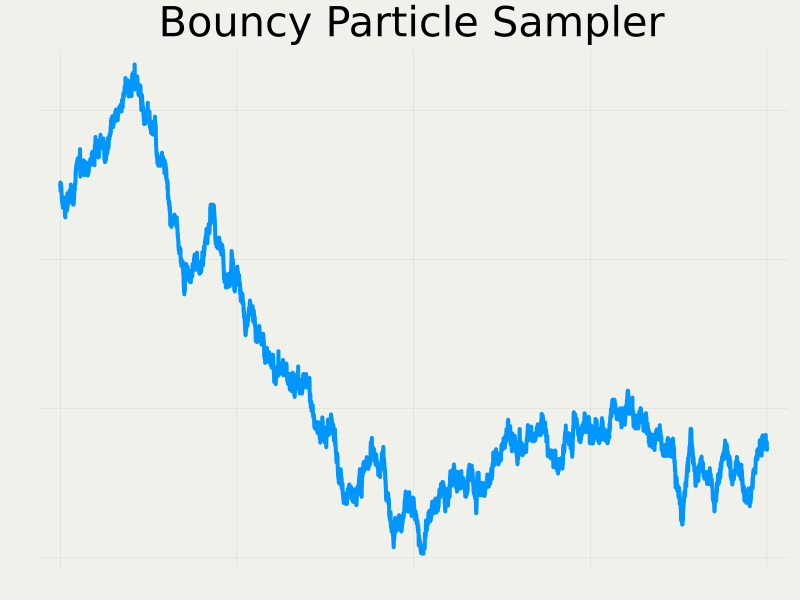

$$
dY_t^{\textcolor{#0096FF}{\text{B}}}=-\frac{\sigma^2_{\textcolor{#0096FF}{\text{B}}}(\rho)}{4}Y_t^{\textcolor{#0096FF}{\text{B}}}\,dt+\sigma_{\textcolor{#0096FF}{\text{B}}}(\rho)\,dB_t
$$
$$
\sigma^2_{\textcolor{#0096FF}{\text{B}}}(\rho)=8\int^\infty_0e^{-\rho s}\E[R_0^{\textcolor{#0096FF}{\text{B}}}R_s^{\textcolor{#0096FF}{\text{B}}}]\,ds
$$
:::

::: {.column width="50%"}
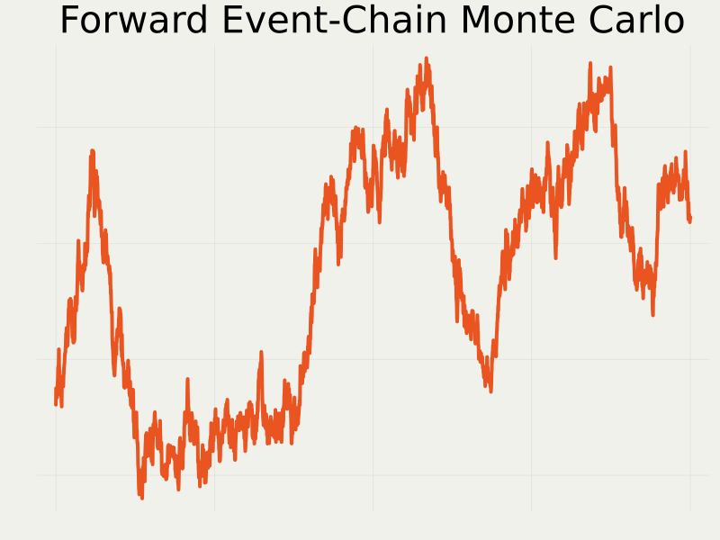

$$
dY_t^{\textcolor{#E95420}{\text{F}}}=-\frac{\sigma^2_{\textcolor{#E95420}{\text{F}}}(\rho)}{4}Y_t^{\textcolor{#E95420}{\text{F}}}\,dt+\sigma_{\textcolor{#E95420}{\text{F}}}(\rho)\,dB_t
$$
$$
\sigma^2_{\textcolor{#E95420}{\text{F}}}(\rho)=8\int^\infty_0e^{-\rho s}\E[R_0^{\textcolor{#E95420}{\text{F}}}R_s^{\textcolor{#E95420}{\text{F}}}]\,ds
$$

:::

::::

### 主貢献2：拡散係数の解析的表示

::: {.callout-tip icon="false" appearance="simple"}

$$
\begin{align*}
\sigma^2_{\textcolor{#E95420}{\text{FECMC}}}(\rho)&=\sqrt{\frac{32}{\pi}}\Paren{1-\frac{\paren{\rho^2-\rho\sqrt{\frac{\pi}{2}}+\Omega(\rho)}^2}{\rho^4\Omega(\rho)(2-\Omega(\rho))}}\\
\sigma^2_{\textcolor{#0096FF}{\text{BPS}}}(\rho)&=\frac{8}{\rho^4}\paren{\rho^3-\rho^2\sqrt{\frac{8}{\pi}}+\rho-\sqrt{\frac{8}{\pi}}\frac{\paren{(1+\rho^2)\Omega(\rho)-\rho^2}^2}{\Omega(2\rho)}}\\
\Omega(\rho)&\coloneqq\sqrt{\frac{\pi}{2}}\rho\operatorname{erfcx}\paren{\frac{\rho}{\sqrt{2}}}=\rho e^{\frac{\rho^2}{2}}\int^\infty_\rho e^{-\frac{t^2}{2}}\,\mathrm{d}t
\end{align*}
$$

:::

$$
\begin{align*}
\underbrace{\frac{\sigma^2(0)}{4}=2\int^\infty_0\E[R_0R_t]\,dt}_{\text{Green--Kubo 公式}}=\E\SQuare{R_0\underbrace{\int^\infty_0\E[R_t|R_0]\,dt}_{=:f(R_0)}}=\E[R_0f(R_0)]
\end{align*}
$$
この関数 $f$ は，動径運動量 $R$ の生成作用素 $L$ に関して次を満たす：
$$
-Lf(x)=x\quad\text{（Poisson 方程式）}
$$

### 拡散係数の比較 [FECMC]{.color-unite} v. [BPS]{.color-blue}

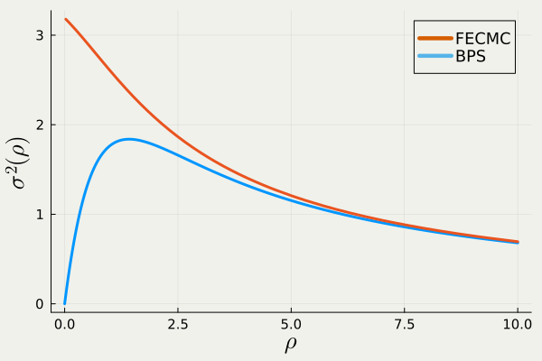{fig-align="center"}

### 拡散係数 $\sigma$ ≒ モンテカルロ漸近分散 ≒ ESS

::: {.callout-tip title="系（拡散係数 $\sigma$ が大きいと ESS も大きい）" icon="false"}

$U$ を長さ $T$ の軌跡で推定する際の有効サンプルサイズ (ESS) は
$$
\operatorname{ESS}(U)=\frac{T\sigma^2}{8}.
$$

:::

<!--
分布 $\pi$ のエントロピー
$$
H(\pi):=\E_\pi[U(X)],\qquad U(x)=-\log\pi(x)
$$
を推定する
-->

【説明】 モンテカルロ推定量（＝[PDMP]{.color-blue} $\textcolor{#0096FF}{\{X_t\}}$ の時間平均）
$$
\wh{h}_T:=\frac{1}{T}\int^T_0U(\textcolor{#0096FF}{X_s})\,ds
$$
の漸近分散比は，高次元極限では次で与えられる：
$$
\lim_{T\to\infty}\lim_{d\to\infty}T\frac{\Var[\wh{h}_{\textcolor{#E95420}{d}T}]}{\Var_\pi[U(X)]}=\frac{8}{\sigma^2}\approx2.50\cdots.
$$
この逆数が単位時間あたりの有効サンプルサイズである．

### 実験との整合：[FECMC]{.color-unite} v. [BPS]{.color-blue} {#sec-experiment}

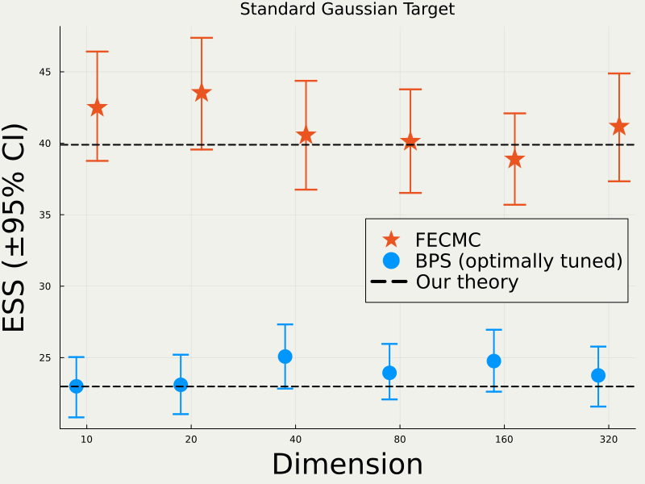{fig-align="center"}

## 応用：[PDMP]{.color-unite} の収束判定

実際の分布 $\pi$ では $\sigma^2$ の値はわからない．これを推定するのが収束判定．

[PDMP]{.color-unite} には補助変数 $\textcolor{#E95420}{\{V_t\}}$ があり，これを利用することでモンテカルロ漸近分散の推定量の分散を改善することができる．

* 理論（スライド [-@sec-theory] & [-@sec-batch-means]）
* 実験（スライド [-@sec-IsoBM] & [-@sec-AnisoBM]）

### 漸近分散推定における [fast proxy]{.color-unite} {#sec-theory}

推定対象 $U(x)=-\log\pi(x)$ の代わりに，その[**時間微分**]{.color-unite} $\textcolor{#E95420}{g(x,\dot{x})}:=\dot{U}$ を考える
$$
\text{例：}\quad U(x)=\frac{\|x\|^2}{2}\quad\text{のときは}\quad \textcolor{#E95420}{g(x,v)}=\brac{x,v}.
$$

２種類のモンテカルロ推定量を考える：

$$
\wh{h}_T:=\frac{1}{T}\int^T_0U(X_s)\,ds,\quad \textcolor{#E95420}{\wh{g}_T}:=\frac{1}{T}\int^T_0\textcolor{#E95420}{g(X_t,V_t)}\,dt.
$$

::: {.callout-tip title="系（モンテカルロ漸近分散は逆にして２倍の値になる）" icon="false"}

$$
\lim_{T\to\infty}\lim_{d\to\infty}T\frac{\operatorname{Var}[\wh{h}_{\textcolor{#E95420}{d}T}]}{\Var_\pi[U(X)]}=\frac{8}{\sigma^2},\quad
\lim_{T\to\infty}\lim_{d\to\infty}T\frac{\operatorname{Var}[\textcolor{#E95420}{\wh{g}_{T}}]}{\Var_{\pi\otimes\mu}[\textcolor{#E95420}{g(X,V)}]}=\frac{\sigma^2}{4}.
$$

:::

→ $\textcolor{#E95420}{d}$ が大きいほど，$\sigma^2$ の値を知るのに，$\textcolor{#E95420}{\wh{g}_T}$ を使った方が有利？

### 漸近分散推定量の例 [Batch Means Estimator]{.color-blue} {#sec-batch-means}

::: {.callout-tip title="系（$\hat{h}$ と $\textcolor{#E95420}{\hat{g}}$ のモンテカルロ漸近分散）" icon="false"}
$$
\lim_{T\to\infty}\lim_{d\to\infty}T\frac{\operatorname{Var}[\wh{h}_{\textcolor{#E95420}{d}T}]}{\Var_\pi[U(X)]}=\frac{8}{\sigma^2},\quad
\lim_{T\to\infty}\lim_{d\to\infty}T\frac{\operatorname{Var}[\textcolor{#E95420}{\wh{g}_{T}}]}{\Var_{\pi\otimes\mu}[\textcolor{#E95420}{g(X,V)}]}=\frac{\sigma^2}{4}.
$$
:::

batch size $b>0$ を設定し，その小区間平均
$$
h_i:=\frac{1}{b}\int^{ib}_{(i-1)b}U(X_t)\,dt
$$
の全体 $h_1,h_2,\cdots,h_B$ の不偏分散の $b$ 倍を [batch means 推定量]{.color-blue}という：
$$
\textcolor{#0096FF}{\frac{b}{B-1}\sum_{i=1}^B(h_i-\ov{h})}\xrightarrow[\text{適切な極限}]{T\to\infty}\lim_{d\to\infty}\lim_{T\to\infty}T\frac{\operatorname{Var}[\wh{h}_{\textcolor{#E95420}{d}T}]}{\Var_\pi[U(X)]}=\frac{8}{\sigma^2}\;\;(\textbf{一致性}).
$$
MSE の意味で最適な $b>0$ が判っている [@Liu+2022]．

### 実験結果：[既存手法]{.color-blue} v. [提案手法]{.color-unite} {#sec-IsoBM}

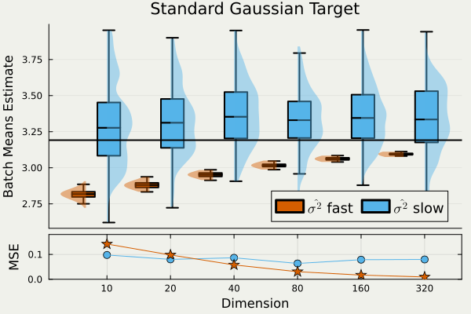{fig-align="center"}

### 非等方的 Gauss：[既存手法]{.color-blue} v. [提案手法]{.color-unite} {#sec-AnisoBM}

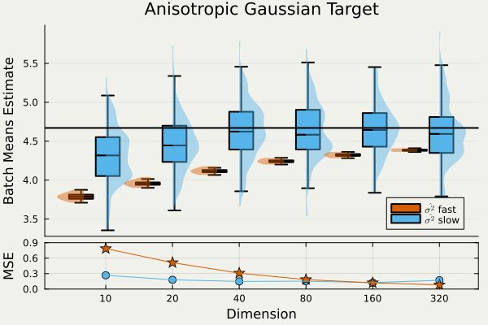{fig-align="center"}

## 引用文献

::: {#refs}
:::

