## Scaling Analysis of Two PDMPs {.unnumbered .unlisted}

* @sec-1: 　What is **PDMP**?
  
  A new class of continuous-time Monte Carlo dynamics
* @sec-2:　 What is scaling analysis?
  
  [**FECMC**]{.color-unite} always performs better than [**BPS**]{.color-blue}
* @sec-3:　Asymptotic variance estimation (≒ ESS estimation)
  
  The **PDMP** framework allow a more efficient estimator

## [[PDMPs]{.color-unite}: A New Frontier of Monte Carlo]{.smaller-letter} {#sec-1}

:::: {.columns style="text-align: center;"}
::: {.column width="33%"}
![[Markov Chain (1953--)]{.large-letter}](ISM/RWMH2.gif)
:::

::: {.column width="33%"}
![[Langevin Diffusion]{.medium-letter .color-blue} [(1978--)]{.large-letter .color-blue}](ISM/LMC.gif)
:::

::: {.column width="33%"}
![[PDMP (2008--)]{.large-letter .color-unite}](ISM/FECMC.gif)
:::
::::



### PDMP: Mathematical Definition

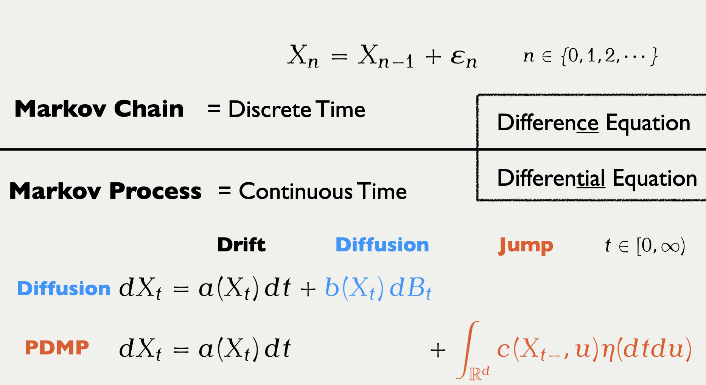{fig-align="center"}

:::: {.columns style="text-align: center;"}

::: {.column width="45%"}
![[Langevin Diffusion]{.color-blue}](ISM/LMC_横長.gif)
:::

::: {.column width="45%"}
![[Randomized Hamiltonian Monte Carlo]{.color-unite}](ISM/RHMC_横長.gif)
:::

::::

### Markov Chain Monte Carlo

computes space averages as time averages

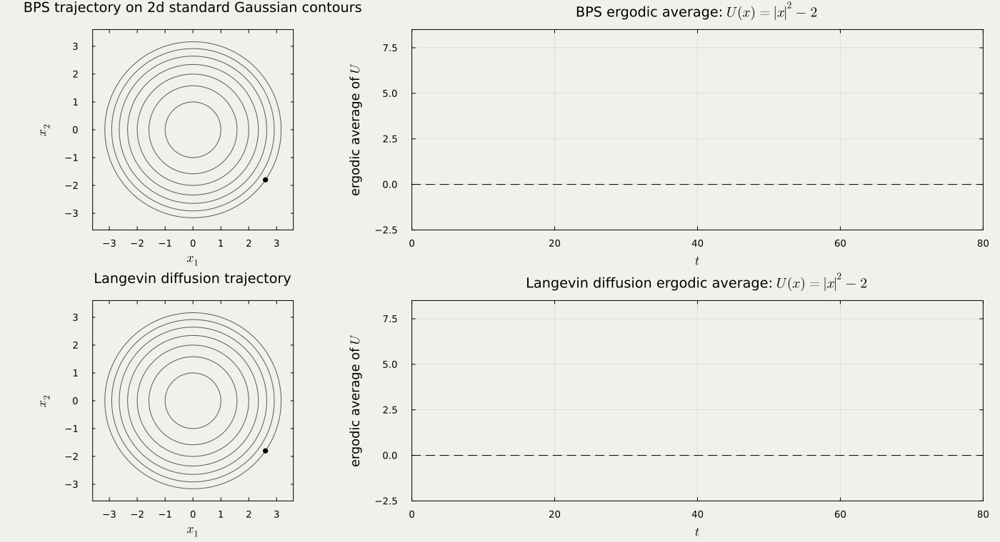{fig-align="center"}

### Persistent Exploration with Hypocoercivity

:::: {.columns style="text-align: left;"}

::: {.column width="30%"}

![[Underdamped Langevin]{.color-blue}](ProbabilityUCL/UnderdampedLangevin.gif){width=80%}
:::

::: {.column width="70%"}

[Kinetic Langevin]{.large-letter .color-blue}

$$
\begin{cases}
\dot{X}_t=V_t,\\
\dot{V}_t=-\big(\nabla U(X_t)-\gamma V_t\big)\,dt+\sqrt{2\gamma}\,dB_t.
\end{cases}
$$
:::

::::

:::: {.columns style="text-align: left;"}

::: {.column width="30%"}

![[Forward Event-Chain Monte Carlo]{.color-unite}](ProbabilityUCL/FECMC.gif){width=80%}
:::

::: {.column width="70%"}

[Velocity-Jump PDMP]{.large-letter .color-unite}

$$
\begin{cases}
\dot{X}_t=V_{t-},\\
\dot{V}_t=\big(\operatorname{Jump}_{X_t}(V_{t-};\eta_t)-V_{t-}\big)\,dN_t.
\end{cases}
$$
:::

::::

### [PDMP]{.color-unite} as a Discretisation Scheme

Many [PDMP]{.color-unite} and MCMC behave similarly in high dimensions [@Deligiannidis+2021]

:::: {.columns style="text-align: center;"}

::: {.column width="50%"}
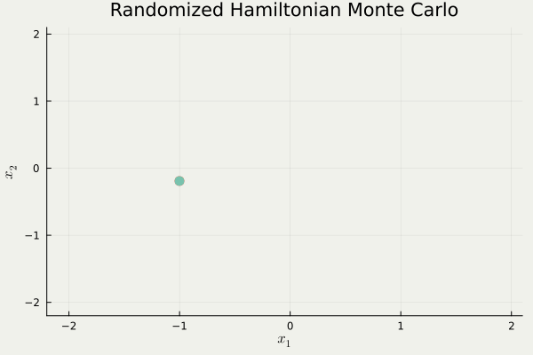

discretized by a symplectic integrator

e.g. HMC has $O(d^{1.25})$ complexity
:::

::: {.column width="50%"}
![[BPS]{.color-unite} with Gaussian speed $(d=10^3)$](ISM/BPS_GaussianSpeed2.gif)

simulate piecewise linear trajectory

e.g. BPS with normal velocity has $O(d^{1.5})$ complexity
:::

::::

### Some Killer Applications of PDMP

:::: {.columns valign="center"}

::: {.column width="70%"}
![$x$: CPU time, $y$: Estimate．[@Bouchard-Cote+2018] Sparse Markov Random Field with $d=10$](ISM/Bouchard-Cote+2018.png)
:::

::: {.column width="30%" .vcenter}

$O(d^1)$ [**Local Implementation**]{.normal-letter .underline}

Exploiting sparsity, [BPS]{style="color: #E67C71;"} atteins better scaling than [HMC]{style="color: #56BCC2;"} (MSE/sec.)

:::

::::

:::: {.columns}

::: {.column width="40%"}
![$x$: sample size $n$, $y$: log ESS/sec, $d=16$ [@Bierkens+2019]](ISM/Bierkens+2019.png){width=70%}
:::

::: {.column width="60%"}
[**Stochastic Gradient**]{.normal-letter .underline} $O(n^0)$

Using an appropriate control variate, [Zig-Zag]{style="color: magenta;"} attains $O(1)$ complexity 
in the limit of $n\to\infty$, it outperforms [Langevin]{style="color: #75FB4D;"}.
:::

::::

## Towards Better Jump Strategy: A Scaling Analysis {#sec-2}

We compare two famous PDMP methods under the following condition:

* ODE: Fixed
* Jump: [Reflection + Refreshment]{.color-blue} vs. [Combination]{.color-unite}
* Target: High dimensional standard Gaussian $U(x):=-\log\pi(x)=\|x\|^2/2$.

{fig-align="center"}

### [BPS]{.color-blue} vs. [FECMC]{.color-unite} {#sec-FECMC-vs-BPS}

:::: {.columns}

::: {.column width="33%"}
![[Bouncy Particle Sampler]{.color-blue} [@Bouchard-Cote+2018]](ISM/BPS_1.0_Trajectory.gif)
:::

::: {.column width="33%"}
![[BPS]{.color-blue} with different hyperparameter $\rho$](ISM/BPS_10.0_Trajectory.gif)
:::

::: {.column width="33%"}
![[Forward Event Chain Monte Carlo]{.color-unite} [@Michel+2020]](ISM/FECMC_0.0_Trajectory.gif)
:::

::::

::: {.content-visible when-format="html" unless-format="revealjs"}
To get straight to the point, we compare the two methods with possibly different hyperparameter values $\rho$.
Once animated, one might easily see the red method, Forward Event-Chain Monte Carlo proposed in [@Michel+2020], is the fastest.
We would like to show this quantitatively, together with dependence upon $\rho$.
:::

### Jump Strategy in [BPS]{.color-blue} vs. [FECMC]{.color-unite}

:::: {.columns}

::: {.column width="33%"}
![[Reflection]{.color-blue .medium-letter}](IMS-APRM/BPS_reflection.png)
:::

::: {.column width="33%"}
![[Refreshment $\rho$]{.color-blue .medium-letter}](IMS-APRM/BPS_refreshment.png)
:::

::: {.column width="33%"}
![[Stochastic Reflection]{.color-unite .medium-letter}](IMS-APRM/FECMC.png)
:::

::::

::: {.content-visible when-format="html" unless-format="revealjs"}
The velocity jump mechanism in [BPS]{.color-blue} is simpler and we start with it.
When jumps, the BPS process either reflect or refresh. On reflection, the process changes the velocity as a light ray does, matching the incidence and reflection angles. On refreshment, the process resamples the velocity from the invariant distribution, a uniform distribution on the unit sphere in our setting.

Forward Event-Chain Monte Carlo, on the other hand, is more sophisticated, combining the two mechanisms.
:::

### Empirical Comparison: [BPS]{.color-blue} vs. [FECMC]{.color-unite} {#sec-comparison}

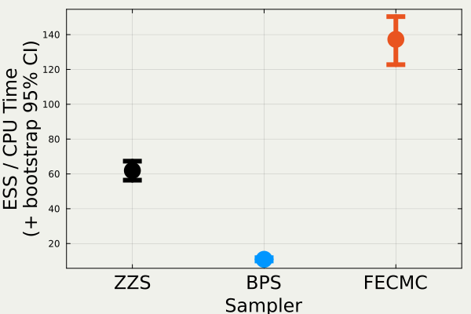

### Scaling Analysis = Deriving a Diffusion Limit

$$
\text{Plotting } \textcolor{#0096FF}{Y_t^{(d)}}=\frac{\abs{\textcolor{#0096FF}{X}_{d\textcolor{#0096FF}{t}}^{\textcolor{#0096FF}{(d)}}}^2-d}{\sqrt{d}} \text{ with } d=10^2,10^3,10^4:
$$

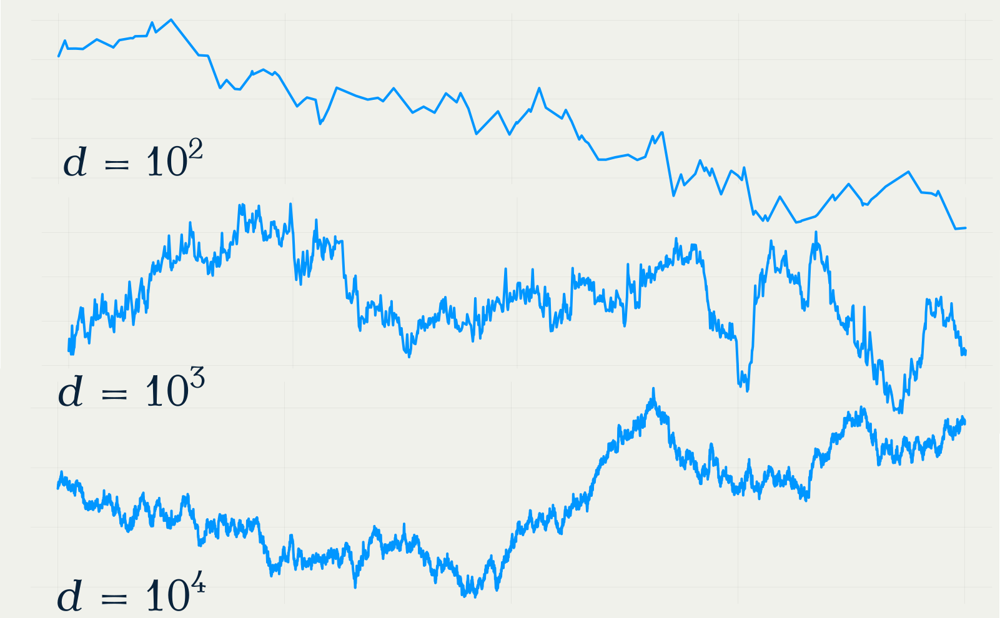{fig-align="center"}

### Theorem 1： Diffusion Limits of [FECMC]{.color-unite} & [BPS]{.color-blue}

:::: {.columns style="text-align: center;"}

::: {.column width="50%"}
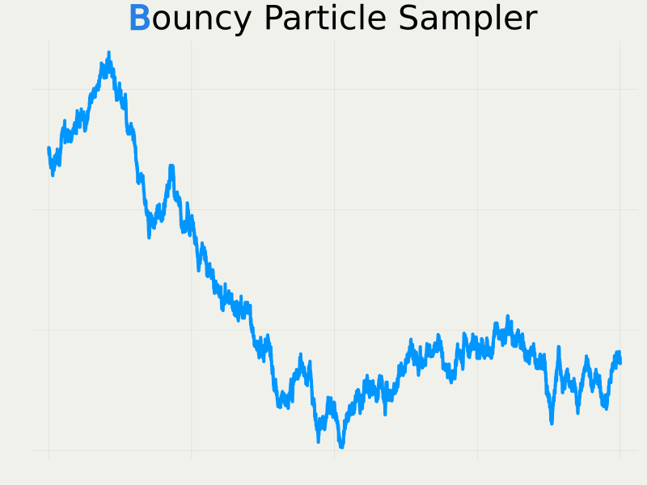

$$
dY_t^{\textcolor{#0096FF}{\text{B}}}=-\frac{\sigma^2_{\textcolor{#0096FF}{\text{B}}}(\rho)}{4}Y_t^{\textcolor{#0096FF}{\text{B}}}\,dt+\sigma_{\textcolor{#0096FF}{\text{B}}}(\rho)\,dB_t
$$
$$
\sigma^2_{\textcolor{#0096FF}{\text{B}}}(\rho)=8\int^\infty_0e^{-\rho s}\E[R_0^{\textcolor{#0096FF}{\text{B}}}R_s^{\textcolor{#0096FF}{\text{B}}}]\,ds
$$
:::

::: {.column width="50%"}
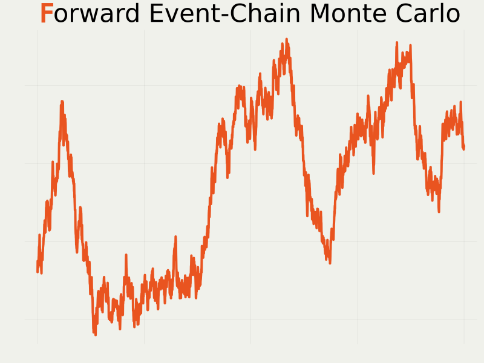

$$
dY_t^{\textcolor{#E95420}{\text{F}}}=-\frac{\sigma^2_{\textcolor{#E95420}{\text{F}}}(\rho)}{4}Y_t^{\textcolor{#E95420}{\text{F}}}\,dt+\sigma_{\textcolor{#E95420}{\text{F}}}(\rho)\,dB_t
$$
$$
\sigma^2_{\textcolor{#E95420}{\text{F}}}(\rho)=8\int^\infty_0e^{-\rho s}\E[R_0^{\textcolor{#E95420}{\text{F}}}R_s^{\textcolor{#E95420}{\text{F}}}]\,ds
$$

:::

::::

### Theorem 2: Analytic Expression of $\sigma^2$'s

![While [BPS]{.color-blue} atteins maximum at non-trivial value of $\rho$, [FECMC]{.color-unite} achieves maximum at $\rho=0$](ISM/sigma.svg){fig-align="center"}

### Sketch of Proof: the non-Markovianity of $Y^d$

::: {.callout-tip title="Doob-Meyer Decomposition [@Doleans-Dade-Meyer1970 Theorem 4]" icon="false"}

$Y^d$ is non-Markovian, but is a (special) semimartingale, having
$$
Y^d_t=Y^d_0+B^d_t+M^d_t,
$$
where $B^d$ is the dual predictable projection of $Y^d$, and $M^d$ is a local $L^2$-martingale.

:::

::: {.callout-tip title="[Convergence of Semimartingales [@Jacod-Shiryaev2003 Theorem IX.3.48]]{.small-letter}" icon="false"}
<!--
The convergence of $B^d$, $C^d_t:=\brac{M^d}_t$, and $\nu^d$ in a suitable sense implies the convergence of $Y^d$, where $\nu^d$ is the dual predictable projection of the jump measure
$$
\mu^d(dtdx)=\sum_{s\ge0}1_{\Brace{\Delta X_s\ne0}}\delta_{(s,\Delta X_s)}(dtdx).
$$
-->
The convergence of $B^d$ and $C^d_t:=\brac{M^d}_t$ (in a suitable sense) to
$$
B_t=-\int^t_0\frac{\sigma^2}{4}Y_s\,ds,\quad C_t=\sigma^2t,
$$
is one of the sufficient conditions of the weak convergence $Y^d\Rightarrow Y$ when
$$
dY_t=-\frac{\sigma^2}{4}Y_t\,dt+\sigma\,dB_t.
$$
:::

### Asymptotic Equivalence to a Skeleton Process

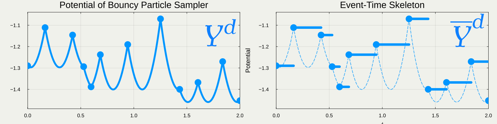{fig-align="center"}

:::: {.columns style="text-align: left;"}

::: {.column width="50%"}
::: {.callout-note icon="false" title="Original Potential Process $\textcolor{#0096FF}{Y^d}$"}
$$
B^d_t=2\sqrt{d}\int^t_0R^d_{ds-}\,ds,%\quad R_t^d:=\brac{X_t^d,V_t^d},
$$
$$
C^d_t=0.
$$
:::

Difficult to see how $C_t=\sigma^2t$ emerges.
:::

::: {.column width="50%"}
::: {.callout-note icon="false" title="Event-Time Skeleton $\textcolor{#0096FF}{\overline{Y}^d}$"}
$$
\ov{B}^d_t=\sum_{n=1}^{N_t}\E[\Delta\ov{Y}^d_n|\ov{\cF}^d_{n-1}]
$$
$$
{\scriptsize \ov{C}^d_t=\sum_{n=1}^{N_t}\paren{\E[(\Delta\ov{Y}^d_n)^2|\ov{\cF}^d_{n-1}]-\E[\Delta\ov{Y}^d_n|\ov{\cF}^d_{n-1}]^2}.}
$$
:::
:::

::::

## Asymptotic Variance Estimation for [PDMP]{.color-unite} [(or continuous-time MCMC more broadly)]{.tiny-letter} {#sec-3}

There is a stark difference between the ergodic averages

$$
\text{PDMP}\quad\wh{h}_T^{\textcolor{#E95420}{\text{PDMP}}}=\frac{1}{T}\int^T_0h(\textcolor{#E95420}{X}_{\textcolor{#E95420}{t}}^{\textcolor{#E95420}{(d)}})\,dt,\quad t\in[0,T],
$$
$$
\text{classical MCMC}\quad\wh{h}_N^{\textcolor{#0096FF}{\text{MCMC}}}=\frac{1}{N}\sum_{n=1}^Nh(\textcolor{#0096FF}{X_n^{(d)}}),\quad n=1,\cdots,N.
$$

Exploiting this continuous-time nature of PDMP, we can use more efficient estimators for the asymptotic variance of $\wh{h}_T^{\textcolor{#E95420}{\text{PDMP}}}$.

::: {.content-visible when-format="html" unless-format="revealjs"}
Algorithmically, there is a fundamental difference in the Monte Carlo estimator produced by PDMP & classical MCMC.
As the algorithm outputs a continuous trajectory, we are able to look into fine structure of the trajectory, which is not possible with classical MCMC.
:::

### Implications of the Diffusion Limit Results

::: {.callout-tip title="Corollary (Relationship between $\sigma^2$ and ESS)" icon="false"}

The effective sample size (ESS) for estimating $U$ with a trajectory of length $\textcolor{#E95420}{d}T$ is given by
$$
\operatorname{ESS}(U)\fallingdotseq\frac{\sigma^2}{8}T\qquad(d\to\infty).
$$

:::

_[Proof]_ The Monte Carlo estimator (= ergodic average of $\textcolor{#E95420}{\{X_t\}}$)
$$
\wh{h}_T^d:=\frac{1}{T}\int^T_0U(\textcolor{#E95420}{X_t^{(d)}})\,dt
$$
has a computable variance under double asymptotic limit:
$$
\lim_{T\to\infty}\lim_{d\to\infty}T\frac{\Var[\wh{h}_{\textcolor{#E95420}{d}T}^d]}{\Var_\pi[U]}=\frac{8}{\sigma^2}\approx2.50\cdots.
$$
ESS equals the inverse of this variance ratio.

### Theory Matches Practice: [FECMC]{.color-unite} vs. [BPS]{.color-blue} {#sec-experiment}

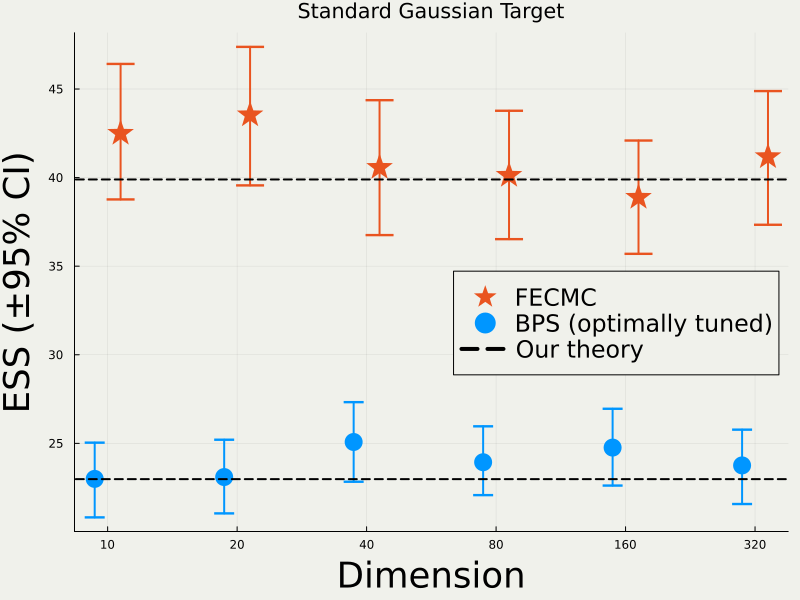{fig-align="center"}

### Asymptotic Variance Estimation for [MCMC]{.color-blue}

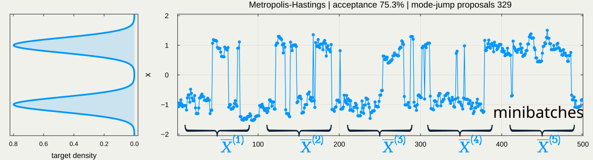{fig-align="center"}

$$
\text{Markov Chain CLT: }\quad\frac{1}{\sqrt{N}}\sum_{n=1}^NX_n\Rightarrow N(0,\sigma^2_{\text{asym}})\quad(N\to\infty).
$$
For mini-batches $b=1,\cdots,B$ with length $m:=N/B$,
$$
\operatorname*{{Batch\; Means\; Estimator:}}_{\text{(for mean estimation)}} \text{ }\quad\wh{\sigma^2}_\text{asym}:=\frac{m}{B-1}\sum_{b=1}^B\left(\textcolor{#0096FF}{\ov{{X}}^{(b)}}-\textcolor{#0096FF}{\ov{{X}}}\right)^2,
$$
where $\textcolor{#0096FF}{\ov{{X}}^{(b)}}=\frac{1}{m}\sum_{n=1}^m\textcolor{#0096FF}{X_{n+(b-1)m}}$ is the mean over the $b$-th batch.

### Optimal Batch Size for [Classical MCMC]{.color-blue} & [PDMP]{.color-unite}

![Due to the continuous-time nature, batch size selection becomes a nontrivial problem for [PDMPs]{.color-unite}.](IMS-APRM/mixture_bps_pdmpflux_trace_T2000_wide_red.svg){fig-align="center"}

:::: {.columns style="text-align: left;"}

::: {.column width="50%"}
::: {.callout-note icon="false" title="MSE Minimizing Batch Size for Classical MCMC [@Liu+2022]"}

$$
m_{\text{opt}}=\paren{\frac{\gamma_{\text{disc}}}{\sigma_{\text{asym}}^2}}^{\frac{2}{3}}N^{\frac{1}{3}}
$$
minimizes the MSE asymptotically under
$$
m\to\infty,\qquad N/m\to\infty,
$$
for a sufficiently mixing Markov chain $\{\textcolor{#0096FF}{X_n}\}$.

:::
:::

::: {.column width="50%"}
::: {.callout-important icon="false" title="Bias Minimizing Batch Size for PDMP (S. & Kamatani 2026+)"}

Analogously, with
$$
\gamma_{\text{disc}}=2\sum_{k=0}^\infty k\operatorname{Cov}[\textcolor{#0096FF}{X_0},\textcolor{#0096FF}{X_k}]
$$
replaced by
$$
\gamma_{\text{cont}}=2\int^\infty_0t\operatorname{Cov}[\textcolor{#E95420}{X_0},\textcolor{#E95420}{X_t}]\,dt.
$$

:::
:::

::::

### Diffusivity Estimation for High-dimensional [PDMPs]{.color-unite}

= **Quadratic Variation (QV) Estimation** under Misspecification

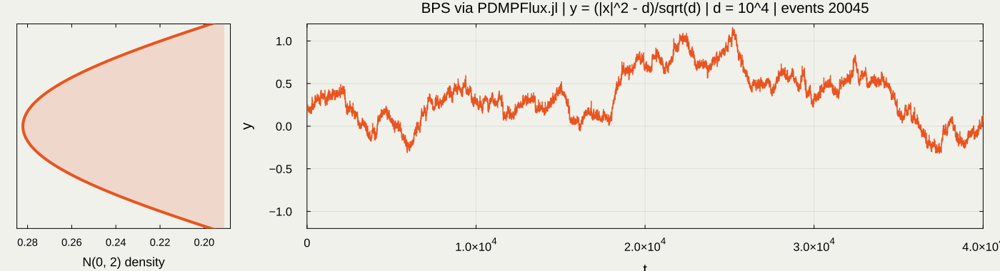{fig-align="center"}

The Realized Volatility estimator [@Barndorff-Nielsen-Shephard2002]
$$
\wh{Q}^d:=\frac{1}{T}\sum_{n=1}^N\Paren{Y_{\Delta n}^d-Y_{\Delta(n-1)}^d}^2,\quad T=\Delta N,
$$
converges to $\sigma^2$ under the conditions
$$
\Delta\to0,\quad d\to\infty,\quad\Delta d\to\infty.
$$

### Experiment: QV Estimation Improves with Dimension

![[slow]{.color-blue} corresponds to the [Batch Means estimator]{.color-blue}, [fast]{.color-unite} corresponds to the [Realized Variation estimator]{.color-unite}](IMS-APRM/BM_iso.svg){fig-align="center"}

### 3.6 Experiment: QV Estimation Improves with Dimension {.unlisted .unnumbered visibility="uncounted"}

![[slow]{.color-blue} corresponds to the [Batch Means estimator]{.color-blue}, [fast]{.color-unite} corresponds to the [Realized Variation estimator]{.color-unite}](IMS-APRM/BM_aniso.svg){fig-align="center"}

### Batch Size Selection for the QV Estimator

$\fallingdotseq$ selecting the sampling step size $\Delta$ **under Misspecification** [@Ait-Sahalia+2011]

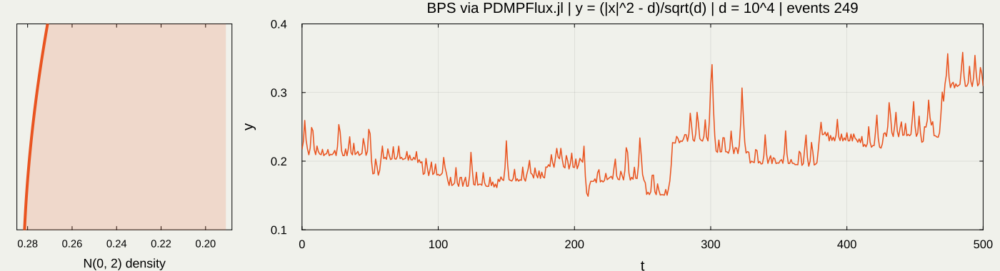{fig-align="center"}

:::: {.columns style="text-align: left;" layout-valign="center"}
::: {.column width="30%"}

For too small / large $\Delta$,
$$
\wh{Q}^{d}(\Delta)\approx0.
$$
The optimal choice seems to be $\Delta=O(d^{1/2})$.

:::

::: {.column width="70%"}
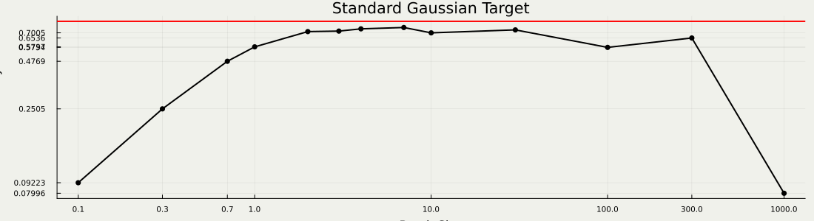{fig-align="center"}
:::
::::

## Conclusion {.unlisted .unnumbered}

1. Reducing redundant noise produces a more efficient algorithm: [BPS]{.color-blue} → [FECMC]{.color-unite}
2. Continuous-time MCMC allows more efficient estimators for asymptotic variance
    * potentially works whenever a diffusion limit exists

## References {.unlisted .unnumbered visibility="uncounted"}

::: {#refs}
:::

